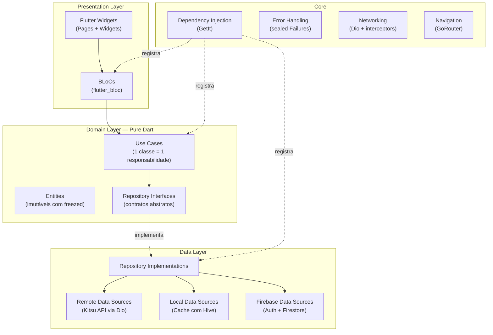
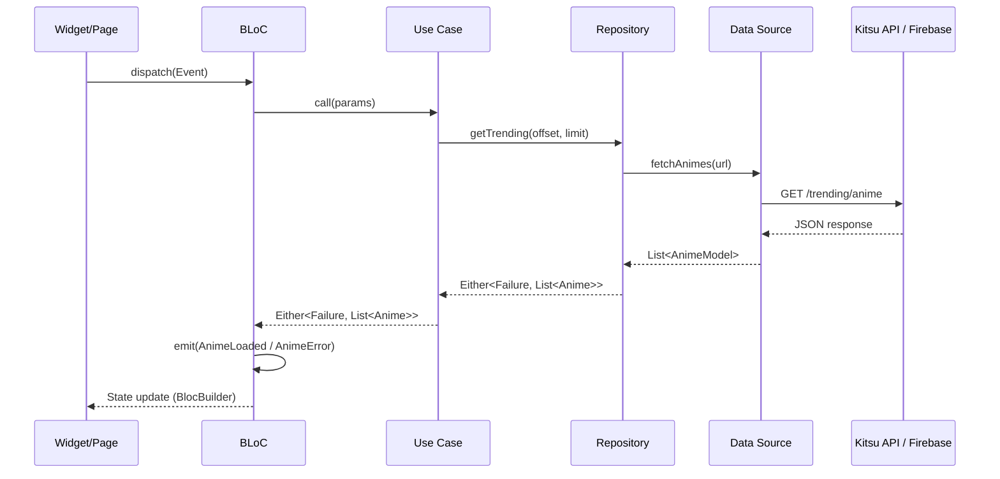

# Arquitetura — Animes IO

## Visão Geral

O projeto segue **Clean Architecture** com organização **feature-first**, refatorado a partir de um código legado (2020) usando agentes de IA.

## Diagrama de Camadas



## Estrutura de Pastas

```
lib/
├── core/
│   ├── di/
│   │   └── injection_container.dart   # GetIt setup
│   ├── error/
│   │   ├── failures.dart              # Failure sealed classes
│   │   └── exceptions.dart            # Exception classes
│   ├── network/
│   │   ├── api_client.dart            # Dio + interceptors
│   │   └── api_endpoints.dart         # URLs centralizadas
│   ├── router/
│   │   └── app_router.dart            # GoRouter config
│   ├── theme/
│   │   ├── app_theme.dart             # ThemeData light/dark
│   │   └── app_colors.dart            # Paleta de cores
│   └── utils/
│       ├── constants.dart
│       └── responsive.dart            # Utilitário de responsividade
│
├── features/
│   ├── anime/
│   │   ├── data/
│   │   │   ├── datasources/
│   │   │   │   ├── anime_remote_datasource.dart
│   │   │   │   └── anime_local_datasource.dart
│   │   │   ├── models/
│   │   │   │   └── anime_model.dart
│   │   │   └── repositories/
│   │   │       └── anime_repository_impl.dart
│   │   ├── domain/
│   │   │   ├── entities/
│   │   │   │   └── anime.dart
│   │   │   ├── repositories/
│   │   │   │   └── anime_repository.dart
│   │   │   └── usecases/
│   │   │       ├── get_trending_animes.dart
│   │   │       ├── get_anime_details.dart
│   │   │       ├── search_animes.dart
│   │   │       └── get_animes_by_category.dart
│   │   └── presentation/
│   │       ├── bloc/
│   │       │   ├── anime_bloc.dart
│   │       │   ├── anime_event.dart
│   │       │   └── anime_state.dart
│   │       ├── pages/
│   │       │   ├── home_page.dart
│   │       │   └── anime_detail_page.dart
│   │       └── widgets/
│   │           ├── anime_card.dart
│   │           ├── anime_grid.dart
│   │           └── anime_detail_tabs/
│   │               ├── synopsis_tab.dart
│   │               ├── episodes_tab.dart
│   │               ├── characters_tab.dart
│   │               └── info_tab.dart
│   │
│   ├── character/    # Mesma estrutura data/domain/presentation
│   ├── category/     # Mesma estrutura data/domain/presentation
│   ├── episode/      # Mesma estrutura data/domain/presentation
│   ├── auth/         # Mesma estrutura data/domain/presentation
│   ├── favorites/    # Mesma estrutura data/domain/presentation
│   └── settings/     # Mesma estrutura data/domain/presentation
│
└── main.dart
```

## Fluxo de Dados



## Error Handling

Todos os erros são tipados via `sealed class`:

```dart
sealed class Failure {
  final String message;
  const Failure(this.message);
}

class ServerFailure extends Failure { ... }
class CacheFailure extends Failure { ... }
class NetworkFailure extends Failure { ... }
class AuthFailure extends Failure { ... }
```

Retornos usam `Either<Failure, T>` do pacote `dartz`:
- `Left(failure)` → erro tratado
- `Right(data)` → sucesso

## Decisões Técnicas

| Decisão | Alternativa Rejeitada | Motivo |
|---|---|---|
| `flutter_bloc` | MobX (legado) | Padrão de mercado 2025, melhor testabilidade |
| `get_it` | `provider` (legado) | DI real, não apenas InheritedWidget |
| `dio` | `http` (legado) | Interceptors, retry, logging |
| `freezed` | classes manuais | Imutabilidade + code gen |
| `go_router` | Navigator 1.0 | Navegação declarativa e tipada |
| `hive` | SharedPreferences | Cache de objetos complexos |
| feature-first | layer-first | Escalabilidade e coesão por domínio |

## Comparação: Antes vs Depois

| Métrica | Antes (Legacy) | Depois (Refatorado) |
|---|---|---|
| Maior arquivo | 571 linhas (27KB) | ~150 linhas |
| God Objects | 3 | 0 |
| Duplicação de código | ~80% entre 2 telas | 0% |
| Chamadas HTTP na UI/Store | 7+ stores | 0 (só em data sources) |
| Tratamento de erros | Nenhum | Failures tipadas em toda chamada |
| Testes | 0 | ~X% de cobertura |
| Null safety | ❌ (Dart 2.7) | ✅ (Dart 3.x) |
| Responsividade | Valores hardcoded | Adaptativo por tamanho de tela |
